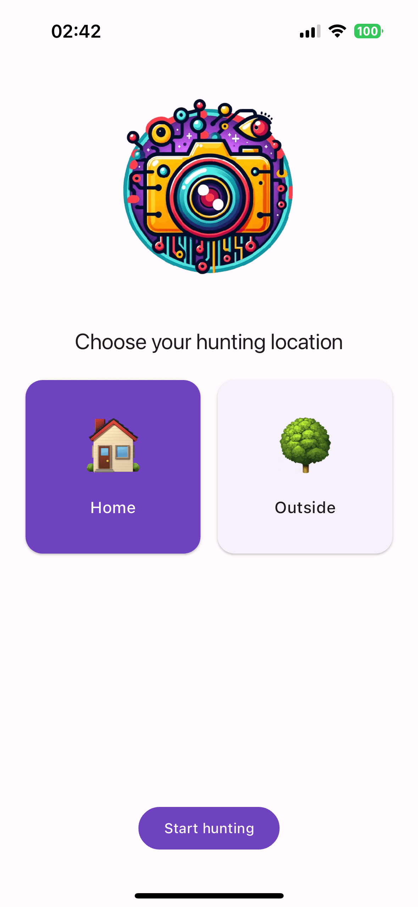
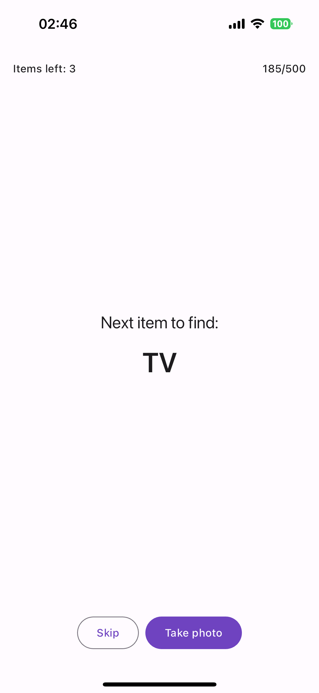
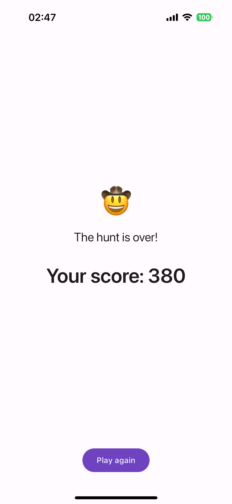

# AI Photo Scavenger Hunt

A fun photo scavenger hunt game implemented using [Flutter](https://flutter.dev) and [Google AI Dart SDK](https://pub.dev/packages/google_generative_ai). Generative AI model used for the project: [Google Gemini Pro Vision](https://cloud.google.com/vertex-ai/docs/generative-ai/multimodal/overview).

<p float="left">
    
	
	
</p>

## Getting Started

You can follow these instructions to build the app and install it onto your device.

### Prerequisites

If you are new to Flutter, please first follow the [Flutter Setup](https://flutter.dev/setup/) guide.

### Building and installing the app (with fake data)

```bash
git clone git@github.com:mkobuolys/ai-photo-scavenger-hunt.git
cd ai-photo-scavenger-hunt
flutter pub get
flutter run --dart-define USE_FAKE_DATA=true
```

The `flutter run` command both builds and installs the Flutter app to your device or emulator.

Notice the `--dart-define USE_FAKE_DATA=true` flag. This flag is used to enable the fake data mode. In this mode, the app uses fake data instead of the Gemini API. This is useful for testing the app without access to the real generative AI model.

### Building and installing the app (with real data)

To use the Gemini API, you'll need an API key. If you don't already have one, create a key in Google AI Studio: https://makersuite.google.com/app/apikey.

When running the app, include your API key using the `--dart-define` flag:

```bash
flutter run --dart-define API_KEY=$GOOGLE_API_KEY
```

### _Optional: Configuration in regions where Gemini API is unavailable_

Here you can see all the available regions for the Gemini API: https://ai.google.dev/available_regions

In such regions, you need to access Gemini via Vertex AI service from Google Cloud Platform:

1. Create your GCP project and enable Vertex AI by following the quickstart guide: https://cloud.google.com/vertex-ai/docs/generative-ai/start/quickstarts/api-quickstart
2. Generate your API key using gcloud CLI:

```bash
gcloud auth print-access-token
```

3. Check your project ID and region. Using these values, generate the URL for your project. It should look like this:

```
https://{region}-aiplatform.googleapis.com/v1/projects/{project-id}/locations/{region}/publishers/google/models
```

4. Pass the API key and project URL to the app using the `--dart-define` flag:

```bash
flutter run --dart-define API_KEY=$GOOGLE_API_KEY --dart-define VERTEX_AI_PROJECT_URL=$VERTEX_AI_PROJECT_URL
```
